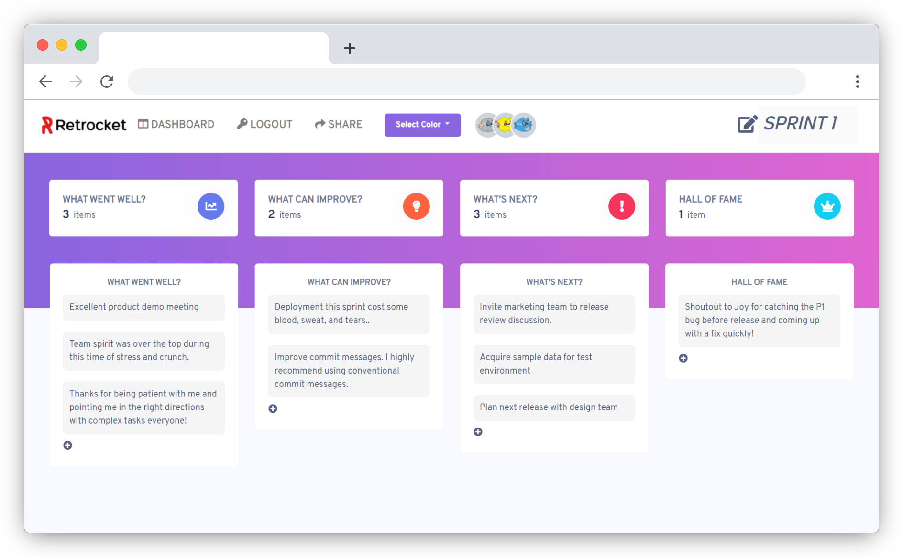

  <br>
  <p align="center"><a href="https://retrocket-app.web.app"></a></p>

<h4 align="center">Web app for team Sprint Retrospective meetings, made with simplicity in mind.</h4><br>
<p align="center"></p>

<p align="center">
  <a href="https://retrocket-app.web.app">
    
  </a>
  <a href="https://github.com/iambae/retrocket/graphs/commit-activity">
      
  </a>
  <a href="https://github.com/iambae/retrocket/commits/master"></a>
  <a href="https://github.com/iambae/retrocket">
    
  </a>
</p>

<p align="center">
  <a href="#overview">Overview</a> •
  <a href="#key-features">Key Features</a> •
  <a href="#how-to-use">How To Use</a> •
  <a href="#development">Development</a>
</p>
<hr>



## Overview

An agile retrospective is a meeting to discuss what happened during the product development and release processes, with the goal of improving the processes in the future based on those learnings and conversations. Not only does this practice **build teamwork**, it also encourages the entire team to pause and reflect on what happened and openly talk about what worked and what didn’t during a particular sprint. The goal is to understand how to replicate the positives in future sprints by **creating new best practices**, **reinforcing existing ones**, and **identifying causes for the negatives** so they can be mitigated going forward.

## Key Features

- Share new retrospective meeting sessions with team members
- Author new retro sessions as email-reigstered user
- Dashboard of past retro sessions as email-registered user
- Join existing retro sessions as anonymous user with name and avatar for display only; to encourage speaking the mind, contribution is anonymous
- Real-time update of team members joining or leaving the session
- Customize color and name of retro boards
- Customize names for each column on per-board basis
- Memo highlights of each session on Dashboard
- Randomly generated quotes to inspire you and your team!

## How To Use

1. Try creating a new retro session! Register with email and password and create a new board from the dashboard. Add some notes to the session if you wish.
2. Ready to start the session? Click on "Share" and send the copied link to your team.
3. Did your scrum master share a session with you? Join the session and choose a display name. The app will automatically choose an avatar for you.
4. Want to author your own retro sessions? Just create an account with email and password and you will be able to create a board and see past sessions at a glance from the Dashboard.

## Development

### Prerequisites

To clone and run this application, you'll need [Git](https://git-scm.com) and [Node.js](https://nodejs.org/en/download/) (which comes with [npm](http://npmjs.com)) installed on your computer. This app also depends on [Web Storage API](https://developer.mozilla.org/en-US/docs/Web/API/Window/sessionStorage).

### Firebase config

1. Head to Firebase and log in with your Google account.
2. Create a Firebase project and go to Firebase console for the project.
3. Navigate to "Authentication > Sign-in method" and under "Sign-in providers", enable "Email/Password" for the project. Also enable "Email link (passwordless sign-in)".
4. Scroll down and enable "Anonymous" sign-in.
5. Scroll down and add project site domain, for both development and production, under "Authorized domains".
6. Create `environments/environment.ts` at root level and add configuration for Firebase. You can find your custom configuration under "Settings > General" tab of Firebase console. The app will pick up any changes to the configuration after each build.

   ```bash
   export const environment = {
   production: false,
   firebaseConfig: {
   		apiKey: "YOUR_API_KEY",
   		authDomain: "YOUR_PROJECT_ID.firebaseapp.com",
   		databaseURL: "https://YOUR_PROJECT_ID.firebaseio.com",
   		projectId: "YOUR_PROJECT_ID",
   		storageBucket: "YOUR_PROJECT_ID.appspot.com",
   		messagingSenderId: "YOUR_MESSAGE_ID"
   	},
   };

   ```

### NoSQL Firestore structure

```bash
# `$`: Firebase-generated unique IDs for documents
├── boards
│   └── $boardId
│       ├── id ($boardId)
│       ├── author
│       ├── color
│       ├── columns
│       ├── created
│       ├── memo
│       ├── name
│       └── cards
│           └── $cardId
│                ├── boardId ($boardId)
│                ├── colId
│                ├── id
│                ├── order
│                └── text
│
├── teams
    └── $teamId
        ├── boardId ($boardId)
        └── members

```

### Commands

From your command line:

```bash
# Clone this repository
$ git clone https://github.com/iambae/retrocket

# Go into the repository
$ cd retrocket

# Install dependencies
$ npm install

# Run the app
$ npm run start
```

```bash
# Completely remove and re-install dependencies and run the app
$ npm run install:clean
```

Now you can open up the app on `http://localhost:4200`.
